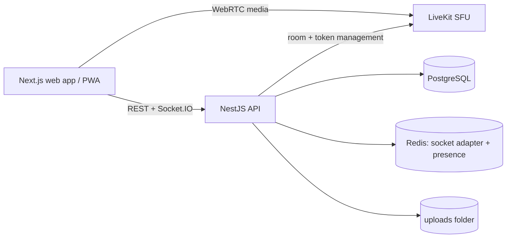

# ChatSphere

WhatsApp-style chat with voice and video calls (up to 10 participants per call) built on NestJS, Next.js, PostgreSQL, Redis and LiveKit.

## Architecture



- Chat, receipts, typing, presence and call signalling go through Socket.IO.
- Audio and video go through LiveKit (an SFU), so 10 people do not each connect to each other.
- The API issues short-lived LiveKit tokens only to members of the chat and refuses an 11th participant.

## Requirements

Node.js 20+, pnpm, Docker Desktop.

## Setup

```powershell
docker compose up -d postgres redis livekit
cd apps/api
copy .env.example .env      # then fill in the values
pnpm install
pnpm exec prisma migrate deploy
pnpm start:dev
# second terminal
cd apps/web
pnpm exec next dev -p 3001
```

Open http://localhost:3001 and sign in with any email. In development the one-time code is shown on screen.

## Environment variables (apps/api/.env)

| Name | Purpose |
| --- | --- |
| DATABASE_URL | PostgreSQL connection string (port 5442 in this repo's compose file) |
| REDIS_URL | Redis for the Socket.IO adapter and presence |
| JWT_ACCESS_SECRET, JWT_REFRESH_SECRET | Token signing secrets, long random strings |
| LIVEKIT_URL, LIVEKIT_HTTP_URL | LiveKit websocket and HTTP addresses |
| LIVEKIT_API_KEY, LIVEKIT_API_SECRET | Must match infra/livekit.yaml |
| WEB_ORIGIN | Comma separated allowed web origins for CORS |
| NODE_ENV | Set to production to hide dev OTPs and enable strict rate limits |

## Tests and tools

- `node apps/api/test-socket.mjs` checks realtime delivery, typing and ticks.
- `node apps/api/loadtest.mjs cap` checks that 10 join a call and the 11th is refused.
- `node apps/api/loadtest.mjs launch 6` opens 6 signed-in browser windows with fake cameras.

## Known limits

- Files are stored on local disk. Use a cloud bucket before deploying.
- OTP delivery is mocked. Connect an SMS or email provider before going live.
- Transport security only; end-to-end encryption is not implemented yet.
- Rate limiting is in memory per server.
